### ● 1 Запуск в режиме клиента и режиме сервера
ServerNetty - файл с main'ом сервера  
ClientNetty - файл с main'ом клиента
### ● 2 TCP / UDP взаимодействие между сервером и клиентом с использованием библиотеки Netty
Netty сам берёт на себя TCP даже из примера user guide, 
а UDP не используется для передачи чувствительных к потере данных, 
поэтому я не уверен, что понял значение этой строки из задания, 
но надеюсь сделал все правильно.  
P.s. после начала написания приложения я узнал о StringEncoder и StringDecoder, 
и еще подумал, что лучше бы клиент с сервером общались какими-нибудь json'ами
(чтобы было легче обрабатывать и чтобы клиент с сервером знали, где конец и начало запросов), 
но это пришло мне в голову слишком поздно, поэтому я решил ничего не переделывать.
### ● 3 В режиме сервера уметь принимать команды от нескольких клиентов одновременно.
Как видно из скрина запущен сервер и два разных клиента, тему создал secondAcc, а увидел 
её mainAcc. Не проверял все это за пределами localhost т.к. нет доступа к нескольким 
компьютерам. Можно было бы арендовать vps за 200 рублей и запустить сервер на нём, 
и если бы это было задание со звездочкой*, то я бы так и сделал.

### ● 4 Логирование в режиме сервера
Использовалась связка slf4j + log4j.  
Логи и конфиг лежат в resources.  
Можно было бы еще понатыкать везде log.info, но мне кажется, что для тестового задания и этого хватит,
поэтому я не стал добавлять слишком много логов и не пользовался log.trace c log.debug.
Также я использовал библиотеки НЕ последних версий, потому что устал от 4 часов нерешаемых 
ошибок (вероятно из-за какой-нибудь несовместимости библиотек, а на форумах ответы были по типу 
"проверьте правильно ли вы указали путь к конфигурационному файлу"), поэтому взял зависимости 
из одного гайда на ютубе. 
### ● 5 Unit тесты
Написал тесты с помощью junit и только для основного класса.
Можно было бы сделать еще кучу тестов для каждой функции, но для тестового задания 
мне кажется достаточно проверить основные команды, что я и сделал.
Также можно было бы добавить mockito, но мне показалось без него будет легче.
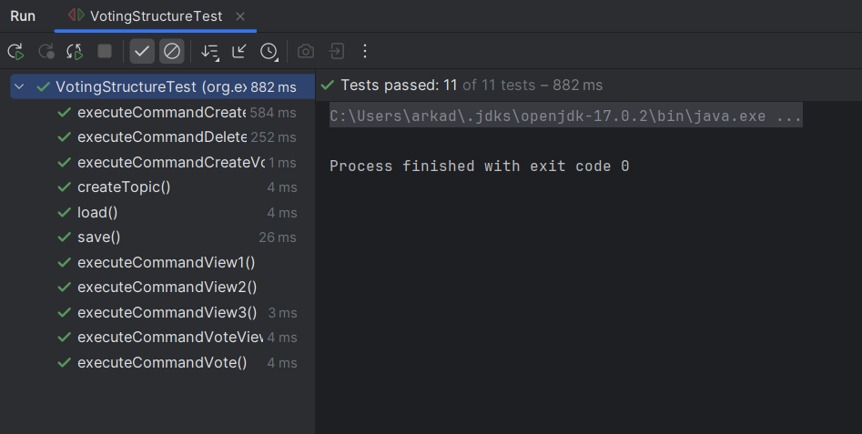
### ● 6 Клиентские команды
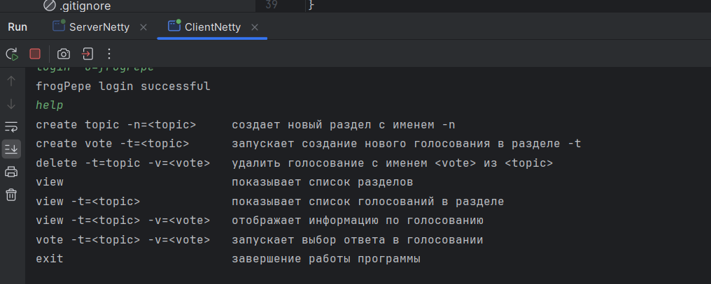
```
login -u=username подключиться к серверу с указанным именем пользователя
```
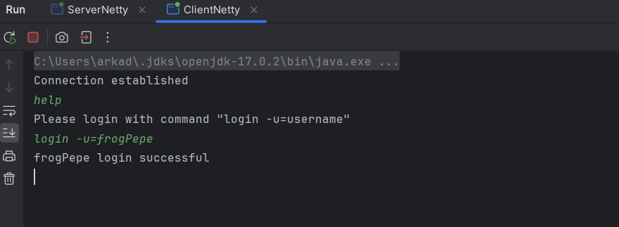
```
create topic -n=<topic> создает новый раздел
```
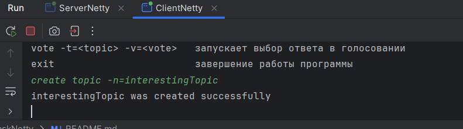
```
create vote -t=<topic>
```
Запускает создание нового голосования в разделе  
Для создания голосования (команда create vote -t=<topic>) нужно
последовательно запросить у пользователя:
- название (уникальное имя)
- тему голосования (описание)
- количество вариантов ответа
- варианты ответа
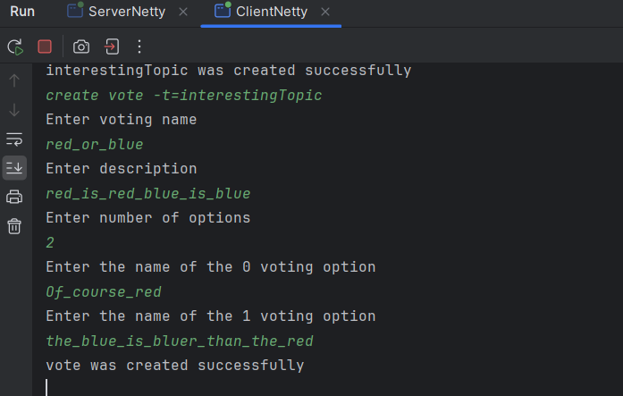
```
vote -t=<topic> -v=<vote> - запускает выбор ответа в голосовании
```
Для этого приложение должно
- вывести варианты ответа для данного голосования
- запросить у пользователя выбор ответа  
  
Не знаю зачем было делать из двух разных команд одну, но решение получилось костыльное,
если бы было несколько таких команд, я бы сделал для такого отдельную функцию или класс(честно-честно).
  
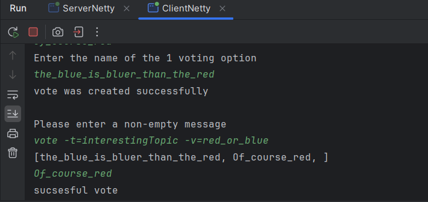
```
view                        показывает список уже созданных разделов  
view -t=<topic>             показывает список голосований в конкретном разделе  
view -t=<topic> -v=<vote>   отображает информацию по голосованию  
```
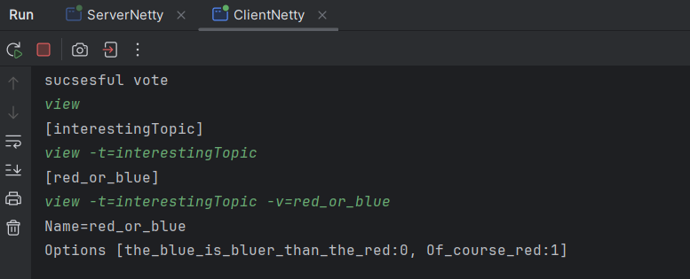
```
delete -t=topic -v=<vote> - удалить голосование с именем <vote> из <topic>
```
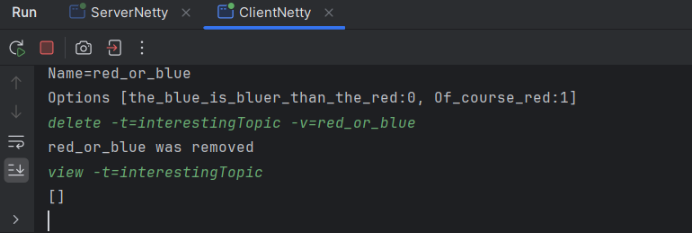
```
exit - завершение работы программы
```
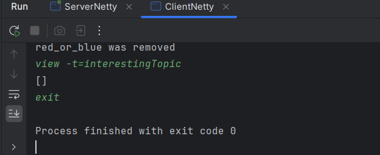
  команды писались в том порядке в котором написаны здесь(кроме help он был после логина)
### ● 7 Серверные команды
```
load <filename> - загрузка данных из файла  
save <filename> – сохранение в файл  
exit - завершение работы программы
```
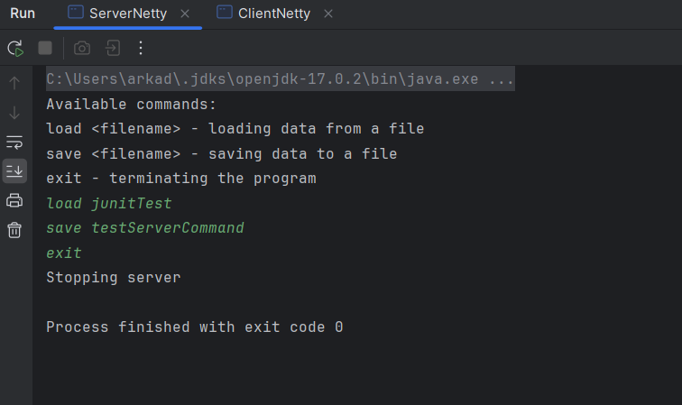
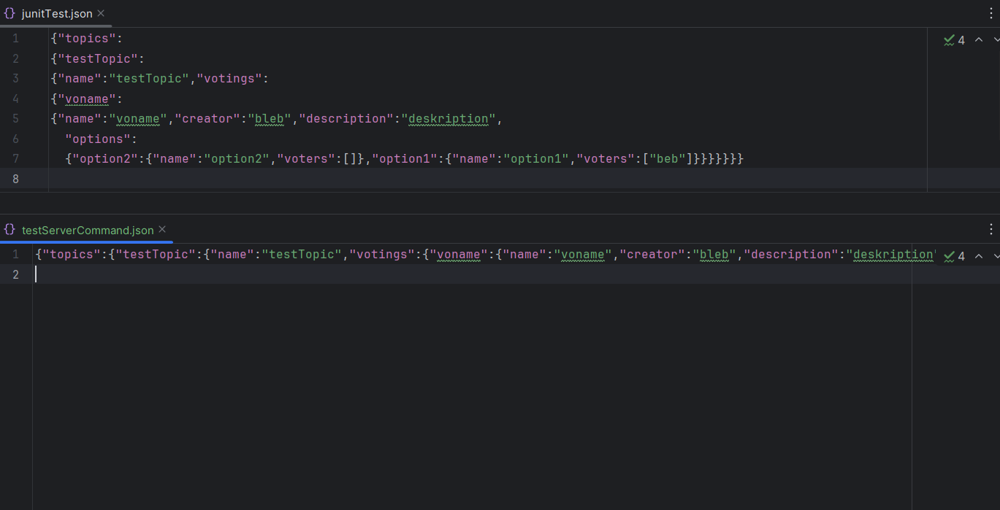
Второй файл немного не похож на первый, но если расставить переносы строк, 
то они будут одинаковы. Опять же проверить можно в resources  
наверное стоило сделать вывод в консоль когда команда выполняется

Еще я не проверял каждый случай и не делал "защиту от дурака", поэтому 
уронить программу довольно просто, решается это банальным натыкиванием везде 
try/catch, но мне не хотелось проверять все команды с неверными параметрами.
Надеюсь это не повлияет на оценивание, и если это все-таки было важно, 
вероятно это стоило указать как один из пунктов задания.  
Надеюсь я не зря писал этот ридми, и он помог в проверке.